# 1) Presentation

The project Mumble is a client-server application used essentially to link the audio volume of players and their positions in game. It has been developed in order to be independent of game. What matter is the X,Y,Z-coordinates, yaw and pitch orientation. In order to update those values for Mumble, developers need to implement a plugin of the game (whatever it is) in order to link the player coordinates in the game and the player coordinates in Mumble.  
This project should never be cloned and used in a stand alone mode. It is an intermediate project that gather supported requests a client and a server can send. This means there is a concrete implementation of the interfaces provided by the project [messenger](https://github.com/Pierre-Emmanuel41/messenger.git). There is also an adapter pattern between interfaces provided by the project messenger and interfaces provided by project [communication](https://github.com/Pierre-Emmanuel41/communication.git)

# 2) Download

First you need to download this project on your computer. To do so, you can use the following command line :

```git
git clone https://github.com/Pierre-Emmanuel41/mumble-common.git --recursive
```

and then double click on the deploy.bat file. This will deploy this project and all its dependencies on your computer. Which means it generates the folder associated to this project and its dependencies in your .m2 folder. Once this has been done, you can add the project as maven dependency on your maven project :

```xml
<dependency>
	<groupId>fr.pederobien</groupId>
	<artifactId>mumble-common</artifactId>
	<version>1.0-SNAPSHOT</version>
</dependency>
```

# 3) Tutorial

### 3.1) Protocol

In order to send requests to the Mumble server and to parse the response, a protocol has been defined based on the architecture provided by the project messenger.

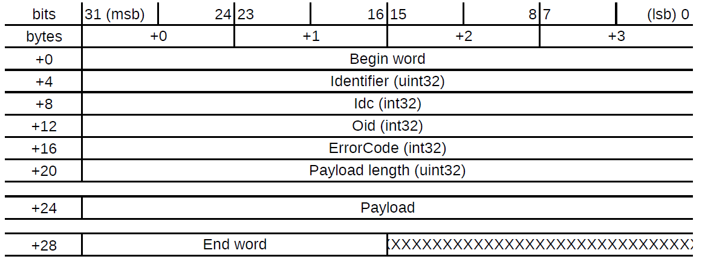

The header structure, provided by the project <code>messenger</code>, is composed of three informations:  

The Idc correspond to the IDentification Code.  
The Oid correspond to the Operation IDentifier.  
The ErrorCode correspond to the error code (quite obvious).

When requests are sent to the remote, the value of the error code is ignored.

### 3.2) IDC, OID and ErrorCode

Please check out the three files [Idc](https://github.com/Pierre-Emmanuel41/mumble-common/blob/master/src/main/java/fr/pederobien/mumble/common/impl/Idc.java), [Oid](https://github.com/Pierre-Emmanuel41/mumble-common/blob/master/src/main/java/fr/pederobien/mumble/common/impl/Oid.java) and [ErrorCode](https://github.com/Pierre-Emmanuel41/mumble-common/blob/master/src/main/java/fr/pederobien/mumble/common/impl/ErrorCode.java) to know more about the supported values.

# 4) Request protocol

### 4.1) Player Join

It is the first request to send to the server. While this request is not sent, all other requests will return nothing but the error code <code>PERMISSION_REFUSED</code> (value = 3).

Idc: <code>PLAYER_JOIN</code> (value = 1).  
Supported Oid: <code>SET</code> (value = 2).  

Payload structure when sent: No payload to furnish.  
Payload structure when received: No payload furnished.  

```java
IMessage<Header> message = MumbleMessageFactory.create(Idc.PLAYER_JOIN, Oid.SET);
```

### 4.2) Player Leave

It is the request to send to the server when the player is leaving the Mumble server.

Idc: <code>PLAYER_LEAVE</code> (value = 2).  
Supported Oid: <code>SET</code> (value = 2).  

Payload structure when sent: No payload to furnish.  
Payload structure when received: No payload furnished.  

```java
IMessage<Header> message = MumbleMessageFactory.create(Idc.PLAYER_LEAVE, Oid.SET);
```

### 4.3) Unique Identifier

Idc: <code>UNIQUE_IDENTIFIER</code> (value = 3).  
Supported Oid: <code>GET</code> (value = 1).  

Payload structure when sent: No payload to furnish.

Payload structure when receiving:  


The unique identifier returned to the client correspond to the string representation of the [UUID](https://docs.oracle.com/javase/7/docs/api/java/util/UUID.html) managed by java.  
If the sent Oid is not <code>GET</code> then the server returns no payload but the header contains the error code <code>INCOMPATIBLE_IDC_OID</code> (value = 5).

```java
IMessage<Header> message = MumbleMessageFactory.create(Idc.UNIQUE_IDENTIFIER);
```

### 4.4) Player Info

It is the request to send to the server in order to get information about the associated player in game.

Idc: <code>PLAYER_INFO</code> (value = 4).  
Supported Oid: <code>GET</code> (value = 1).  

Payload structure when sent: No payload to furnish.  

Payload structure when received:  


Remarques:  
* The value of both Online and Admin Status can only be 0 (false) or 1 (true).
* If the Online Status equals 0 then the player is not connected in game. In that case, the rest of the payload is not furnished.
* The index "+12" for the Admin Status is an indicative value because it depends on the player name length.

If the sent Oid is not <code>GET</code> then the server returns no payload but the header contains the error code <code>INCOMPATIBLE_IDC_OID</code> (value = 5).

```java
IMessage<Header> message = MumbleMessageFactory.create(Idc.PLAYER_INFO);
```

### 4.5) Player Admin

It is the request received only from the server when the player's admin status in the game has changed.

Idc: <code>PLAYER_ADMIN</code> (value = 5).  
Supported Oid: <code>SET</code> (value = 1).  

Payload structure when received:  

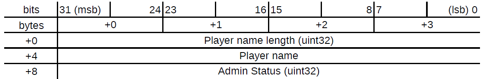

```java
// Received from the remote
byte[] bytes = new byte[1024];
IMessage<Header> response = MumbleMessageFactory.parse(bytes);
```

### 4.6) Channels

It is the request to send to the server in order to get the channels list, to add, remove and rename a channel.

Idc: <code>CHANNELS</code> (value = 6).  
Supported Oid: <code>GET</code> (value = 1), <code>SET</code> (value = 2), <code>ADD</code> (value = 3), <code>REMOVE</code> (value = 4).  

The payload structure is different according to the Idc:

* <code>GET</code>

Payload structure when sent: no payload to furnish.

Payload structure when received:


The response is composed of blocks on each the developer has to iterate. The first four bytes indicate the number of channels the Mumble server contains.  
Then comes informations about each channel: The channel name length and the channel name, the sound modifier name length and the sound modifier name, the number of player currently registered on the channel.  
Then comes informations about each player: The player name length and the player name, the mute status (0 = false, 1 = true) and the deafen status (0 = false, 1 = true).  

```java
IMessage<Header> message = MumbleMessageFactory.create(Idc.CHANNELS);
```

* <code>ADD</code>

Payload structure when sent and when received:

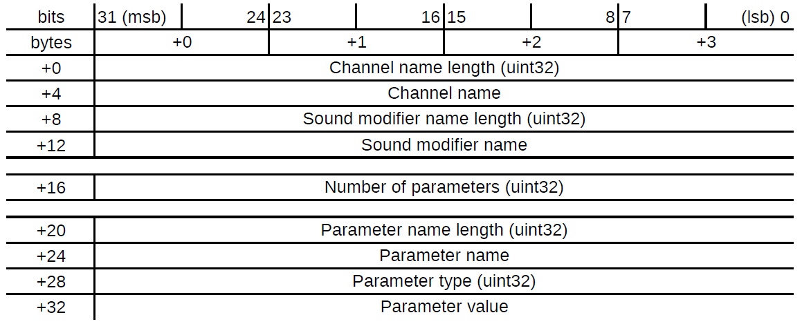

The combination of channel name length and channel name correspond to the channel to add to the server. The combination of sound modifier name length and sound modifier name correspond to the sound modifier associated to the channel.  

It may be possible that the channel to add is already registered on the server. In that case, the server return no payload but the header contains the error code <code>CHANNEL_ALREADY_EXISTS</code> (value = 7).  
It may be possible that the sound modifier to attach does not correspond to a registered modifier. In that case, the server return no payload but the header contains the error code <code>SOUND_MODIFIER_DOES_NOT_EXIST</code> (value = 13).  

```java
IMessage<Header> message = MumbleMessageFactory.create(Idc.CHANNELS, Oid.ADD, "Channel 1", "Sound modifier 1");
```

* <code>REMOVE</code>

Payload structure when sent and when received:

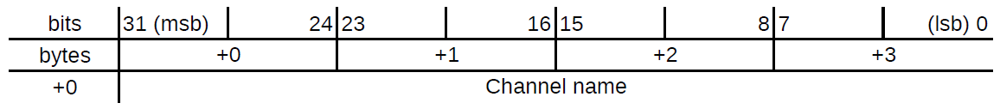

In contrast to before, there is no indication about the channel name length. Indeed, the payload contains only the channel name.

It may be possible that the channel to remove is not registered on the server. In that case, the server return no payload but the header contains the error code <code>CHANNEL_DOES_NOT_EXISTS</code> (value = 8).  

```java
IMessage<Header> message = MumbleMessageFactory.create(Idc.CHANNELS, Oid.REMOVE, "Channel 1");
```

* <code>SET</code>

Payload structure when sent and received:

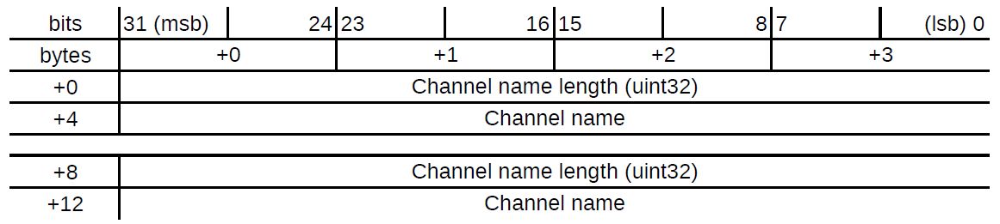

The first combination of channel name length and channel name correspond to the channel to rename. The second combination of channel name length and channel name correspond to the new name of that channel.  

It may be possible that the channel to rename is not registered on the server. In that case, the server returns no payload but the header contains the error code <code>CHANNEL_DOES_NOT_EXISTS</code> (value = 8).  
It may be possible that the new name of the channel is already used by another channel. In that case, the server returns no payload but the header contains the error code <code>CHANNEL_ALREADY_EXISTS</code> (value = 7).  

If the sent Oid is not <code>GET</code> nor <code>SET</code> nor <code>ADD</code> nor <code>REMOVE</code> then the server returns no payload but the header contains the error code <code>INCOMPATIBLE_IDC_OID</code> (value = 5).

```java
IMessage<Header> message = MumbleMessageFactory.create(Idc.CHANNELS, Oid.SET, "Channel 1", "Channel 2");
```

### 4.7) Channels player

It is the request to send to the server in order to add or remove a player from a channel.

Idc: <code>CHANNELS_PLAYER</code> (value = 7).  
Supported Oid: <code>ADD</code> (value = 3), <code>REMOVE</code> (value = 4).  

The payload structure when sent and received:

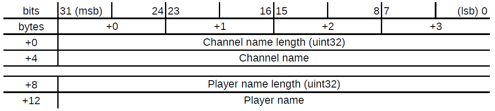

The first combination of channel name length and channel name correspond to the channel to which a player should be added or removed. The second combination of player name length and player name correspond to the player to add or remove from a channel.  

It may be possible that the channel involved is not registered on the server. In that case, the server returns no payload but the header contains the error code <code>CHANNEL_DOES_NOT_EXISTS</code> (value = 8).  
It may be possible that the player involved is not connected on the server. In that case, the server returns no payload but the header contains the error code <code>PLAYER_NOT_RECOGNIZED</code> (value = 9).  
It may be possible that the player involved is already registered in a channel. In that case, the server returns no payload but the header contains the error code <code>PLAYER_ALREADY_REGISTERED</code> (value = 10).

If the sent Oid is neither <code>ADD</code> nor <code>REMOVE</code> then the server returns no payload but the header contains the error code <code>INCOMPATIBLE_IDC_OID</code> (value = 5).  

```java
IMessage<Header> message = MumbleMessageFactory.create(Idc.CHANNELS_PLAYER, Oid.ADD, "Channel 1", "Player 1");
IMessage<Header> message = MumbleMessageFactory.create(Idc.CHANNELS_PLAYER, Oid.REMOVE, "Channel 1", "Player 1");
```

### 4.8) UDP port

It is the request to send to the server in order to get udp port on which there is the vocal communication.

Idc: <code>UDP_PORT</code> (value = 8).  
Supported Oid: <code>GET</code> (value = 1).  

Payload structure when sent: No payload to furnish.

Payload structure when received:


If the sent Oid is not <code>GET</code> then the server returns no payload but the header contains the error code <code>INCOMPATIBLE_IDC_OID</code> (value = 5).

```java
IMessage<Header> message = MumbleMessageFactory.create(Idc.UDP_PORT);
```

### 4.9) Player speak

It is the request to send to the server when a player is speaking. This request should be send through the UDP connection, not through the TCP connection.

Idc: <code>PLAYER_SPEAK</code> (value = 9).  
Supported Oid: <code>GET</code> (value = 1), <code>SET</code> (value = 2).  

The payload structure is different according to the Idc:

* <code>GET</code>

Payload structure when sent:

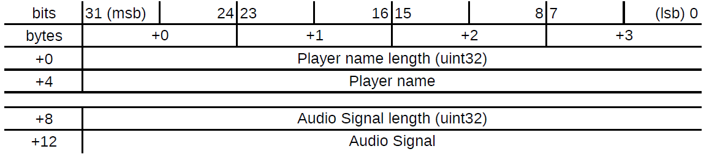

It is recommended to the developer to read this [file](https://github.com/Pierre-Emmanuel41/mumble-client/blob/master/README.md) in order to know the properties of the audio signal.  
If the sent oid is not <code>GET</code> then the request is ignored by the server.

Payload structure when received: No such request with oid GET can be received from the server.

```java
// Received from the microphone
byte[] bytes = new byte[1024];
IMessage<Header> message = MumbleMessageFactory.create(Idc.PLAYER_SPEAK, bytes);
```

* <code>SET</code>

Payload structure when sent: Request ignored.

Payload structure when received:


The combination of the player name length and player name correspond to the player that is currently speaking. The combination audio signal length and audio signal correspond to the audio signal the client associated to the player is sending to the server.  
The global volume correspond to the global volume of the audio signal calculated by the server. The left and right volume correspond to the stereo effect of the signal. Those two values are also calculated by the server.

```java
// Received from the remote
byte[] bytes = new byte[1024];
IMessage<Header> response = MumbleMessageFactory.parse(bytes);
```

### 4.10) Player mute

It is the request to send to the server when a player mutes itself.

Idc: <code>PLAYER_MUTE</code> (value = 10).  
Supported Oid: <code>GET</code> (value = 1), <code>SET</code> (value = 2).  

The payload structure is different according to the Idc:

* <code>GET</code>

Payload structure when sent and received:


The mute status can only be 0 (false) or 1 (true).  
It may be possible that the player is not registered in a channel. In that case, the server returns no payload but the header contains the error code <code>PLAYER_NOT_REGISTERED</code> (value = 8).  
It may be possible that the player is not known by the server. In that case, the server returns no payload but the header contains the error code <code>PLAYER_NOT_RECOGNIZED</code> (value = 9).  
If the sent Oid is not <code>GET</code> then the server returns no payload but the header contains the error code <code>INCOMPATIBLE_IDC_OID</code> (value = 5).  

```java
IMessage<Header> message = MumbleMessageFactory.create(Idc.PLAYER_MUTE, true);
```

* <code>SET</code>

Payload structure when received:


The combination of the player name length and player name correspond to the player whose mute status has changed.  
The mute status can only be 0 (false) or 1 (true).  

```java
// Received from the remote
byte[] bytes = new byte[1024];
IMessage<Header> response = MumbleMessageFactory.parse(bytes);
```

### 4.11) Player mute by

It is the request to send to the server when a player mute another player but only for itself.

Idc: <code>PLAYER_MUTE_BY</code> (value = 11).  
Supported Oid: <code>SET</code> (value = 2).  

Payload structure when sent and received:

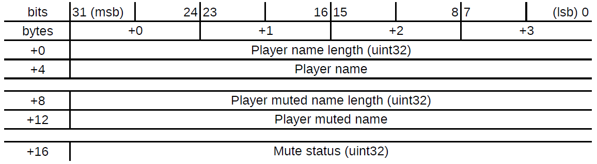

The combination of the player name length and player name correspond to the player that is muting another player for itself.  
The combination of the player muted name length and player muted name correspond to the player that will be muted.  
The mute status can only be 0 (false) or 1 (true).  

It may be possible that the muting player name and the associated player name in game are different. In that case, the server returns no payload but the header contains the error code <code>UNEXPECTED_ERROR</code> (value = 4).  
It may be possible that the player muted name does not correspond to a known player. In that case, the server returns no payload but the header contains the error code <code>PLAYER_NOT_RECOGNIZED</code> (value = 9).  
It may be possible that the player muted player is not in the same channel as the muting player. In that case, the server returns no payload but the header contains the error code <code>PLAYERS_IN_DIFFERENT_CHANNELS</code> (value = 11).  

If the sent Oid is not <code>SET</code> then the server returns no payload but the header contains the error code <code>INCOMPATIBLE_IDC_OID</code> (value = 5).  

```java
IMessage<Header> message = MumbleMessageFactory.create(Idc.PLAYER_MUTE_BY, Oid.SET, "Player 1", "Player 2", true);
```

### 4.12) Player deafen

It is the request to send to the server when a player deafen itself.

Idc: <code>PLAYER_DEAFEN</code> (value = 12).  
Supported Oid: <code>GET</code> (value = 1), <code>SET</code> (value = 2).  

The payload structure is different according to the Idc:

* <code>GET</code>

Payload structure when sent and received:


The deafen status can only be 0 (false) or 1 (true).  
It may be possible that the player is not registered in a channel. In that case, the server returns no payload but the header contains the error code <code>PLAYER_NOT_REGISTERED</code> (value = 8).  
It may be possible that the player is not known by the server. In that case, the server returns no payload but the header contains the error code <code>PLAYER_NOT_RECOGNIZED</code> (value = 9).  
If the sent Oid is not <code>GET</code> then the server returns no payload but the header contains the error code <code>INCOMPATIBLE_IDC_OID</code> (value = 5).  

```java
IMessage<Header> message = MumbleMessageFactory.create(Idc.PLAYER_DEAFEN, true);
```

* <code>SET</code>

Payload structure when received:


The combination of the player name length and player name correspond to the player whose deafen status has changed.  
The deafen status can only be 0 (false) or 1 (true).  

```java
// Received from the remote
byte[] bytes = new byte[1024];
IMessage<Header> response = MumbleMessageFactory.parse(bytes);
```

### 4.13) Player kick

It is the request to send to the server when a player wants to kick another player from a channel. This request can only be sent by an admin.

Idc: <code>PLAYER_KICK</code> (value = 13).  
Supported Oid: <code>SET</code> (value = 2).  

Payload structure when sent and received:


The combination of the player name length and player name correspond to the player that is kicking another player from a channel.  
The combination of the player kicked name length and player kicked name correspond to the player that will be kicked.  

It may be possible that the kicking player name and the associated player name in game are different. In that case, the server returns no payload but the header contains the error code <code>UNEXPECTED_ERROR</code> (value = 4).  
It may be possible that the kicked player is not registered in a channel. In that case, the server returns no payload but the header contains the error code <code>PLAYER_NOT_REGISTERED</code> (value = 8).  
It may be possible that the player kicked name does not correspond to a known player. In that case, the server returns no payload but the header contains the error code <code>PLAYER_NOT_RECOGNIZED</code> (value = 9).  

If the sent Oid is not <code>SET</code> then the server returns no payload but the header contains the error code <code>INCOMPATIBLE_IDC_OID</code> (value = 5).  

```java
IMessage<Header> message = MumbleMessageFactory.create(Idc.PLAYER_KICK, "Player 1", "Player 2");
```

### 4.14) Sound modifier

It is the request to send to the server in order to get informations about sound modifiers.

Idc: <code>SOUND_MODIFIER</code> (value = 14).  
Supported Oid: <code>GET</code> (value = 1), <code>SET</code> (value = 2), <code>INFO</code> (value = 5).  

The payload structure is different according to the Idc:

* <code>GET</code>

Payload structure when sent:

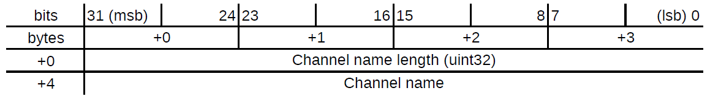

The combination of the channel name length and channel name correspond to the channel whose the sound modifier should be returned.  

It may be possible that the channel involved is not registered on the server. In that case, the server returns no payload but the header contains the error code <code>CHANNEL_DOES_NOT_EXISTS</code> (value = 8).  

```java
IMessage<Header> message = MumbleMessageFactory.create(Idc.SOUND_MODIFIER, "Channel 1");
```

Payload structure when received:

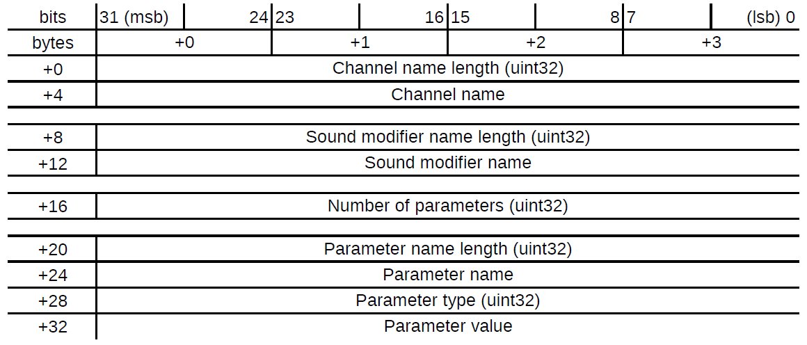

The combination of the channel name length and channel name correspond to the channel whose the sound modifier is returned.  
The combination of the sound modifier name length and sound modifier name correspond to the sound modifier associated to the channel.  

It may be possible that the channel involved is not registered on the server. In that case, the server returns no payload but the header contains the error code <code>CHANNEL_DOES_NOT_EXISTS</code> (value = 8).  
It may be possible that the sound modifier involved is not registered on the server. In that case, the server returns no payload but the header contains the error code <code>SOUND_MODIFIER_DOES_NOT_EXIST</code> (value = 13).  

```java
// Received from the server
byte[] bytes = new byte[1024];
IMessage<Header> response = MumbleMessageFactory.parse(bytes);
```

* <code>SET</code>

This request can only be sent byte an admin.

Payload structure when sent and received:

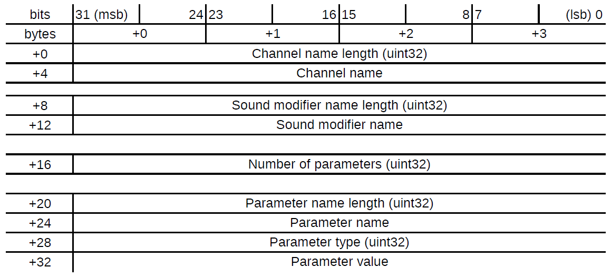

The combination of the channel name length and channel name correspond to the channel whose the sound modifier is returned.  
The combination of the sound modifier name length and sound modifier name correspond to the sound modifier associated to the channel.  

It may be possible that the channel involved is not registered on the server. In that case, the server returns no payload but the header contains the error code <code>CHANNEL_DOES_NOT_EXISTS</code> (value = 8).  
It may be possible that the sound modifier involved is not registered on the server. In that case, the server returns no payload but the header contains the error code <code>SOUND_MODIFIER_DOES_NOT_EXIST</code> (value = 13).  

```java
IMessage<Header> message = MumbleMessageFactory.create(Idc.SOUND_MODIFIER, Oid.SET, "Channel 1", "Sound modifier 1");
```

* <code>INFO</code>

Payload structure when sent: no payload to furnish.

Payload structure when received:

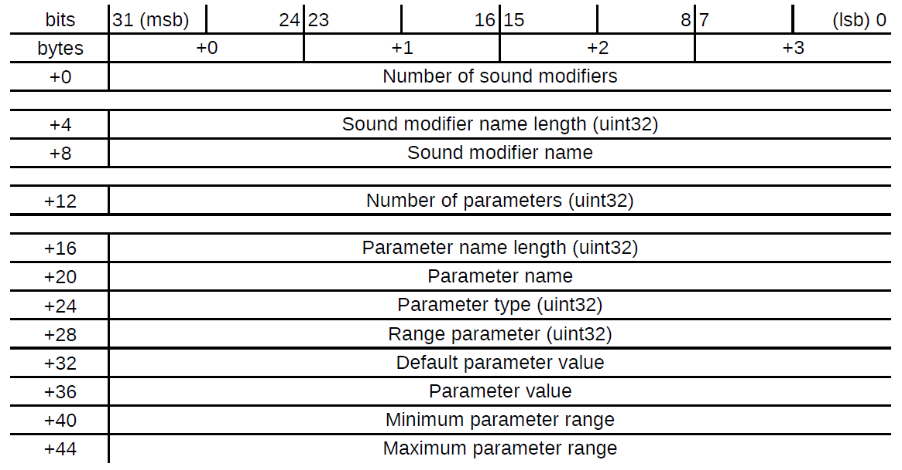

The response is composed of blocks on each the developer has to iterate. The first four bytes indicate the number of sound modifier the Mumble server contains.  
Then comes informations about each modifier: The sound modifier name length and the sound modifier name.  

If the sent Oid is neither <code>GET</code> nor <code>SET</code> nor <code>INFO</code> then the server returns no payload but the header contains the error code <code>INCOMPATIBLE_IDC_OID</code> (value = 5).  

```java
// Received from the server
byte[] bytes = new byte[1024];
IMessage<Header> response = MumbleMessageFactory.parse(bytes);
```